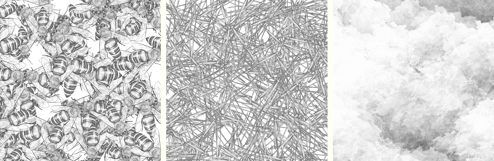

# mechanical-pencil
A system for creating generative art built in Processing (with Hype Framework).



The software pulls in hand-drawn sketches of specific items and creates a dynamic, randomized arrangement based on a series of predefined rules. As more and more sketches are layered onto the canvas, the individual objects get lost in the complexity of the emerging patterns and textures.


## Getting Started

### Requirements

1. [Processing 3](https://processing.org)
2. [Hype Framework](https://www.hypeframework.com)
3. [controlP5](http://www.sojamo.de/libraries/controlP5/)

### Installing
Install Hype and ControlP5 via the Contribution Manager in Processing:
In the Processing IDE, choose `Sketch > Import Library... > Add Library...`

Alternately, download the current version from the respective site and add the library files to the `libraries` folder inside the folder indicated for `Sketchbook Location` in the Processing preferences.

### Setup

To run the app, you need at least one PNG image in your project, and a config file that indicates how to process that image in the sketch. 

#### Config 
The `build.pde` sketch loads configuration data from the `data/config.json` file.  
This is the minimum required info in the config file:
```
{
  "layers": [
    {
      "imageNames": [
        "darkJellies/jellyfish3.png"
      ],
      "imagePoolSize": 5,
    },
  ]
}
```

Your config will list an array of one or more Layer objects for which you must specify the `imageNames` array, and the `imagePoolSize` count.

There are many more configuration options available. See the [included config file](build/data/config/config.json) as an example or see the [Config Options](#config-options) section for details.

#### Images
Project images should be placed in the `data/images` folder. Subfolders are ok.
Transparent PNGs will work best.

## Usage
The app works by randomly placing copies of your image onto the canvas. The parameters defined in your configuration dictate the rules for placement and randomization.

Compositions can be saved from the app as print-quality images, or as smaller previews with associated data files. 

### Key Commands

**`1`-`9`**: Reposition images for the associated layer. Images are cumulative, so each key press adds more images to the composition. The number defined for `imagePoolSize` dictates how many images will appear for each key press.   

Hold **`Shift`** while pressing the layer number to re-stamp the images in the same locations. This can emphasize a certain placement of images if the `imageAlpha` is less than 100%.  

**`X`**: Clear the canvas.

**`S`**: Save a preview image with associated data to the `output` folder.  

**`SHIFT + S`**: Save a print-resolution image with associated data to the `output` folder.  

**`C`**: Save the data file only (without image).  

**`L`**: Load settings from a config or image data file.  

**`SHIFT + L`**: Reconstitute a composition from a data file.  

**`R`**: Reload data.  

**`D`**: Reconstitute a composition from a data file **at double the original resolution**. 

**`SHIFT + R`**: Start the [Render Queue](#render-queue).

**`E`**: Toggle the settings editor.  

**`M`**: Toggle the Key Commands Menu.

### Render Queue
Saving large, complex compositions at print-resolution can sometimes be slow. My preferred workflow is to save smaller preview images (`s` key) while I'm working and reconstitute them from the data files later to export the full size images.

To automate this process, place the data files for your images in the `data/renderQueue` folder, run the sketch and press `SHIFT + R` to sequentially process the files, saving a print-resolution image for each data file.


## Config Options

### Project Settings
**`printResolution`** (integer)  
The resolution to use for your hi-res image exports.

**`printHeightInches`** (number)  
The height of your hi-res image in inches.

**`printWidthInches`** (number)  
The width of your hi-res image in inches.

**`layers`** (array)  
An array of objects which describe settings for each layer in your sketch.

### Layer Settings
**`imageNames`** (array)
A list of one or more strings that define the paths to the images that will be used for this layer. Images are randomly pulled from this array so you won't always see every image, particularly if `imagePoolSize` is smaller than the number of images listed here.

Image paths are relative to the project's `data/images/` folder.

**`imagePoolSize`** (integer)   
The number of images that will be added to the layer canvas each time the layer is randomized.

**`minScale`** (number)  
**`maxScale`** (number)  
Images will be scaled by a random value between these minimum and maximum values.

**`imageAlpha`** (integer)  
The transparency value to be used for each image on this layer (0-255).

**`shouldRotate`** (boolean)  
Whether or not a random rotation should be applied to the images.

**`rotationOffset`** (number)
The default amount of rotation applied to each image (in degrees).

**`rotationAmount`** (number)  
The maximum amount of random rotation (in degrees) to be applied if `shouldRotate` is true.

**`rotateAroundCenter`** (boolean)  
Whether images on this layer should all be rotated around the center point of the canvas. Setting this to `true` overrides the `shouldRotate` and `rotationAmount` settings. `rotationOffset` will still be applied.

**`shouldFlipX`** (boolean)
**`shouldFlipY`** (boolean)
Whether to allow the images to be flipped along the `x` and `y` axes.

**`flipOnBothAxesOnly`** (boolean)
Set to true to ensure that a flipped image never appears backwards. Useful for images that have text or other directionality.

**`edgeMarginInches`** (number)   
How much space (in inches) to leave around the canvas edges.

**`bleedMargins`** (boolean)  
Whether or not images should be allowed to extend into the margins. When set to `true`, image center points will be kept out of the margins, but the images themselves might extend into the margin area. 

**`containingCircleRadius`** (number)  
Instead of edge margins, specify a circular radius (in inches) within which images will be placed.


**`avoidCenter`** (boolean)  
When `true`, provide a `centerMarginInches` value to specify the size of the center area which should be left empty.

**`centerMarginInches`** (number)  
The radius (in inches) of the circular area at the center of the canvas which should be left empty. Set `avoidCenter` to use this value.

**`constrainToImage`** (boolean)
When set to `true`, provide a black and white image to use as a mask for image placement. Images in this layer will only appear in locations where the mask image is white.

**`imageMaskName`** (string)  
The path to the image mask to be used when `constrainToImage` is `true`. Path is relative to the `data/images/` folder.


## License

This project is licensed under the Unlicense - see the [LICENSE.md](LICENSE.md) file for details.
